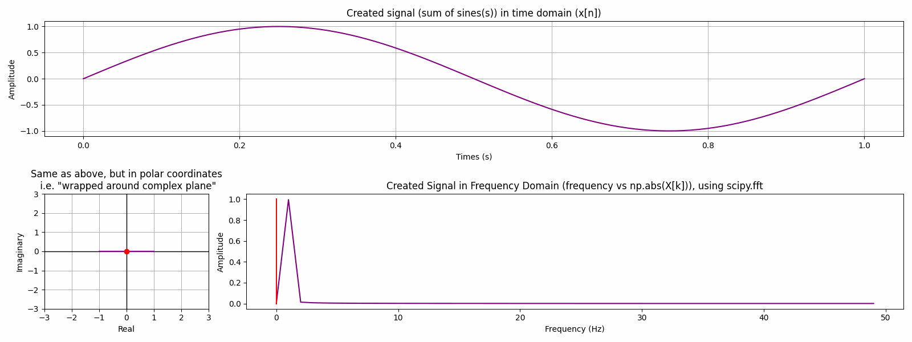

# Interactive Fourier Transform Visualisation

An interactive Jupyter Notebook for exploring the **Discrete Fourier Transform (DFT)** and seeing how a signal moves between the time domain, complex plane, and frequency domain.



## Features

- Combine up to three sine waves into a signal.
- Adjust frequency, sample rate, duration, and wrapping frequency interactively.
- Visualise the signal wrapped around the complex plane.
- Compare a direct DFT implementation with `scipy.fft`.
- Switch between continuous-style and discrete samples.
- Explore **aliasing** in a separate interactive notebook.

## Getting started

Clone the repository:

```bash
git clone https://github.com/EwoutBergsma/Interactive-Fourier-Transform-Visualisation.git
cd Interactive-Fourier-Transform-Visualisation
```

Install the dependencies:

```bash
python -m pip install -r requirements.txt
```

Then open the notebooks in Jupyter:

- `Interactive_DFT_Visualisation.ipynb` — main Fourier transform visualisation
- `Aliasing_Visualisation.ipynb` — interactive aliasing demonstration

Use the sliders and checkboxes to change the signal parameters and see the plots update.

## Versions

Tested on Python 3.14.3, make sure to install compatible versions of the dependencies (e.g. using `python -m pip install -r requirements.txt`).